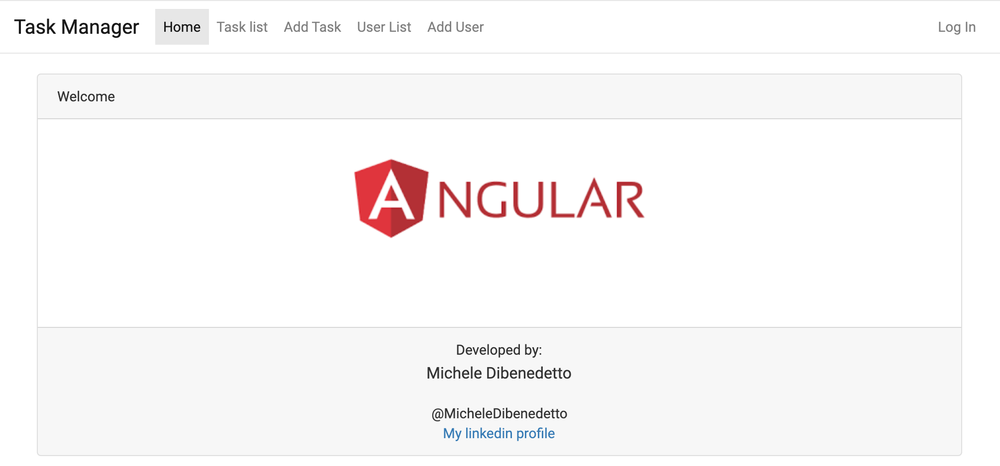

[Demo link](https://mdibenedetto.github.io/task-manager/welcome)

This repo showes some of the most import Angular features such as:

- Modoules
- Services and providers
- Module Lazy loading
- Interceptors
- Pipes
- Routing
  - queryParams
  - Child Routes
  - Resolvers
  - Guards
